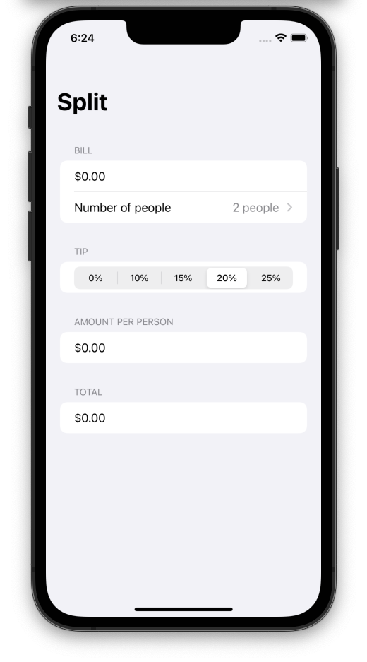

# Split
## A simple tip calculator for iOS and macOS implemented in Swift

The app allows the user to calculate the tip amount and split a restaurant bill between multiple people. This iOS 15 app utilizes Swift 5.4 and the SwiftUI framework. The app was built as part of the [Hacking with Swift](https://www.hackingwithswift.com) 100 Days of SwiftUI course.

